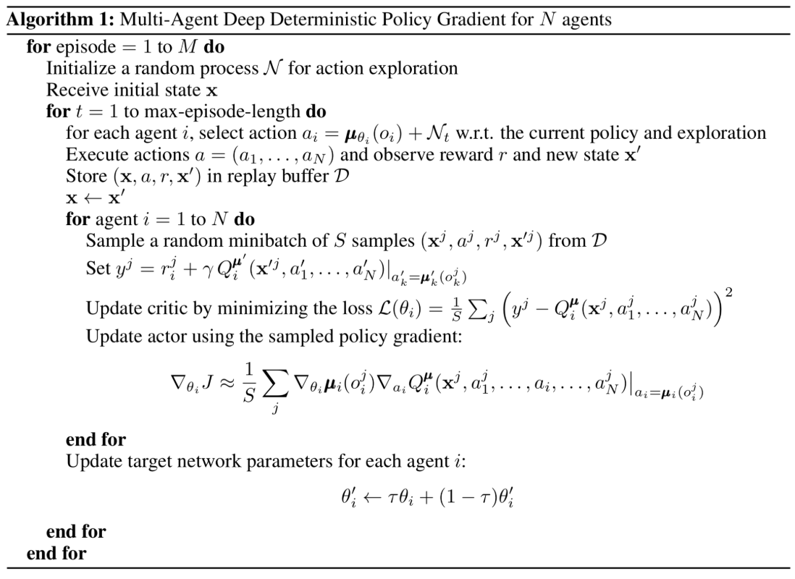
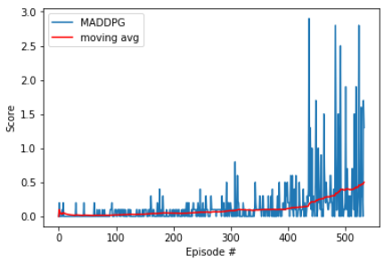

# Collaboration-and-Competition
Deep Reinforcement Learning Nanodegree Project 3 (Multiagent RL)

## The Environment
The goal of this project is to train two Reinforcement learning (RL) agents to keep the ball in play.
In this environment, if an agent hits the ball over the net, it receives a reward of +0.1. If an agent lets a ball hit the ground or hits the ball out of bounds, it receives a reward of -0.01. The observation space consists of eight variables corresponding to the position and velocity of the ball and racket. Each agent receives its own, local observation and has two continuous actions (i.e. moving toward/away from the net, and hitting upwards.

To solve the environment, an average score of +0.5 over 100 consecutive episodes needs to be achieved (i.e. after each episode, the rewards that each agent received are added to get a score for each agent; then the maximum of these two scores to yield a single score for each episode). There are several hyperparameters in the implementation of the multi-agent deep deterministic policy gradient (MADDPG) algorithm, and one could find the best choice of parameters through grid search; however, in this work, only a couple of tuning parameters were tested. 

## Algorithm
The Tennis environment has two agents with continuous action spaces, which allows each agent to execute more complex and precise movements (i.e. move forward, backward, or jump) with an unlimited range of possible action values that control these movements. Policy-based methods are well-suited for continuous action spaces. Both value-based and policy-based methods can learn deterministic policies. In addition, policy-based methods can also learn true stochastic policies, and directly learn the optimal policy, without having to maintain a separate value function estimate. On the other hand, in value-based methods, the agent uses its experience with the environment to maintain an estimate of the optimal action-value function, from which an optimal policy is derived. This intermediate step requires the storage of lots of additional data for all possible action values. Even with discretization of the action space, the number of possible actions can get quite large; then, using DQN to determine the action, that maximizes the action-value function within a continuous or high-dimensional space, requires a complex optimization process at every timestep. 

In order to implement the `MADDPG` algorithm, the vanilla single-agent DDPG was used as a template (i.e. the paper `Multi-Agent Actor-Critic for Mixed Cooperative-Competitive Environments`, by Lowe and Wu, was implemented. Actor-critic methods leverage the strengths of both policy-based and value-based methods. Using a policy-based approach, the agent (actor) learns how to act by directly estimating the optimal policy and maximizing reward through gradient ascent. Meanwhile, employing a value-based approach, the agent (critic) learns how to estimate the value (i.e., the future cumulative reward) of different state-action pairs. Actor-critic methods combine these two approaches in order to accelerate the learning process. Actor-critic agents are also more stable than value-based agents, while requiring fewer training samples than policy-based agents (i.e. decentralized actor with centralized critic approach). This makes training easier and allows for centralized training with decentralized execution. Each agent still takes actions based on its own unique observations of the environment.

Traditionally, with regards to exploration vs exploitation (i.e. choose an action based on the rewards observed vs try a new action in hopes of earning a higher reward), 𝛆-greedy algorithm can be deployed. This algorithm allows the agent to systematically manage the exploration vs. exploitation trade-off. The agent "explores" by picking a random action with some probability epsilon 𝛆; and, the agent continues to "exploit" its knowledge of the environment by choosing actions based on the deterministic policy with probability (1-𝛆). However, this approach won't work for controlling the tennis agents, since the actions are no longer a discrete set of simple directions, and if the exploration is based on random uniform sampling, the direction actions would have a mean of zero, in turn canceling each other out, which results the system to oscillate without making much progress.

Here, the Ornstein-Uhlenbeck process was used to add a certain amount of noise to the action values at each timestep; the noise is correlated to previous noise and therefore tends to stay in the same direction for longer durations without canceling itself out. This allows the agent to maintain velocity and explore the action space with more continuity. There are three hyperparameters that determine the noise characteristics and magnitude:

- $\mu$: the long-running mean
- $\theta$: the speed of mean reversion
- $\sigma$: the volatility parameter

Notice also there's an epsilon parameter used to decay the noise level over time. This decay mechanism ensures that more noise is introduced earlier in the training process (i.e., higher exploration), and the noise decreases over time as the agent gains more experience (i.e., higher exploitation). The starting value for epsilon and its decay rate are two hyperparameters that were tuned during experimentation. The noise output from the Ornstein-Uhlenbeck (OU) process encourages aggressive exploration of the action space and therefore improves the chances that signal would be detected (i.e., making contact with the ball). This extra signal seemed to improve learning later in training once the noise decayed to zero. 

During the learning process, an interval is defined in which the learning step is performed every episode. The algorithm then samples experiences from the buffer and runs the algorithm  for a number of passes per learning step. Experience replay allows the RL agent to learn from past experience. Experiences are stored in a single replay buffer as each agent interacts with the environment. These experiences are then utilized by the central critic, therefore allowing the agents to learn from each others' experiences. The replay buffer contains a collection of experience tuples with the state, action, reward, and next state. The critic samples from this buffer as part of the learning step. Experiences are sampled randomly, so that the data is uncorrelated. This prevents action values from oscillating or diverging catastrophically, since a naive algorithm could otherwise become biased by correlations between sequential experience tuples.

The final tuning hyper-parameters are listed below:

`BUFFER_SIZE = int(1e6): replay buffer size`

`BATCH_SIZE = 128: minibatch size`

`LR_ACTOR = 1e-3: learning rate of the actor`

`LR_CRITIC = 1e-3: learning rate of the critic`

`WEIGHT_DECAY = 0: L2 weight decay`

`LEARN_EVERY = 1: learning timestep interval`

`LEARN_NUM = 1: number of learning passes`

`GAMMA = 0.99: discount factor`

`TAU = 7e-2: for soft update of target parameters`

`OU_SIGMA = 0.2: Ornstein-Uhlenbeck noise parameter, volatility`

`OU_THETA = 0.12: Ornstein-Uhlenbeck noise parameter, speed of mean reversion`

`EPS_START = 5.5: initial value for epsilon in noise decay process`

`EPS_EP_END = 250: episode to end the noise decay process`

`EPS_FINAL = 0: final value for epsilon after decay`

And here is the actor and critic network configurations:

Actor Network:
- (fc1): Linear(in_features=(state_size*2), out_features=256, ReLU)
- (fc2): Linear(in_features=256, out_features=128, ReLU)
- (fc3): Linear(in_features=128, out_features=2, tanh)

Critic Network:
- (fc1): Linear(in_features=(state_size*2)*2, out_features=256, ReLU)
- (fc2): Linear(in_features=256+(action_size*2), out_features=128, bias=True)
- (fc3): Linear(in_features=128, out_features=1)

The MADDPG algorithm for mixed cooperative-competitive environments is summarized below:

## List of Files

Below is the list of files used to implement the above MADDPG algorithm:
- `Tennis.ipynb`: main notebook
- `ddpg.py`: actor and critic local and target definition
- `maddpg.py`: MADDPG algorithm main implementation file
- `networkforall.py`: actor/critic network definition 
- `OUNoiseModule.py`: Ornstein-Uhlenbeck noise definition
- `ReplayBufferModule.py`: replay buffer definition
- `checkpoint_actor_0.pth`: actor #0 saved network weights checkpoint
- `checkpoint_actor_1.pth`: actor #1 saved network weights checkpoint 
- `checkpoint_critic_0.pth`: critic #0 saved network weights checkpoint
- `checkpoint_critic_1.pth`: critic #1 saved network weights checkpoint

## Results
Once all of the above components were in place, the agents were able to solve the Tennis environment. Again, the performance goal is an average reward of at least +0.5 over 100 episodes, taking the best score from either agent for a given episode.

`Episodes 0000-0100	Maximum Score: 0.200	 Average Over 100 Episodes: 0.022`

`Episodes 0100-0200	Maximum Score: 0.400	 Average Over 100 Episodes: 0.049`

`Episodes 0200-0300	Maximum Score: 0.500	 Average Over 100 Episodes: 0.082`

`Episodes 0300-0400	Maximum Score: 0.800	 Average Over 100 Episodes: 0.114`

`Episodes 0400-0500	Maximum Score: 2.900	 Average Over 100 Episodes: 0.385`

`Environment solved in 534 episodes with an average of 0.501 over the last 100 episodes`

The graph below shows the final training results. The best-performing agents were able to solve the environment in 534 episodes. The complete set of results and steps can be found in this notebook.

## Future Improvements

- Prioritizing experience replay: Rather than selecting experience tuples randomly, prioritized replay selects experiences based on a priority value that is correlated with the magnitude of error. This can improve learning by increasing the probability that rare or important experience vectors are sampled.
- Batch Normalization: Running computations on large input values and model parameters can inhibit learning. Batch normalization addresses this problem by scaling the features to be within the same range throughout the model and across different environments and units. In additional to normalizing each dimension to have unit mean and variance, the range of values is often much smaller, typically between 0 and 1.
- Solving Soccer challenge
- Implementing a multiagent ddpg with shared buffer and shared target network
